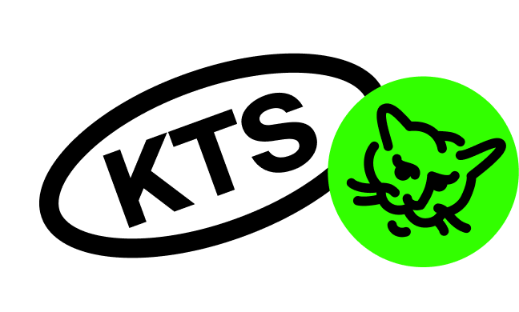

# @ktsstudio/mediaproject-styles

Пакет с общими стилями для медиапроектов.

### Использование

`npm install @ktsstudio/mediaproject-styles`

`yarn add @ktsstudio/mediaproject-styles`

### Методы

* [markup](./src/markup.ts) - утилита для адаптивной верстки на rem

### Миксины и анимации

* [mixins.ts](./src/mixins.ts) - миксины для styled-components
* [animations.ts](./src/animations.ts) - анимации для styled-components
* [mixins.scss](./src/mixins.scss) - миксины для Sass
* [animations.scss](./src/animations.scss) - анимации для Sass

Чтобы использовать миксин или анимацию в проекте с styled-components, импортируйте его из библиотеки:

```typescript
import { mixins } from '@ktsstudio/mediaproject-styles';
```

Чтобы использовать миксин или анимацию в проекте с Sass, импортируйте файл с ним:

```scss
@import '~@ktsstudio/mediaproject-styles/dist/mixins';
```

### Обратная связь
Любой фидбэк вы можете передать нам на почту [hello@ktsstudio.ru](mailto:hello@ktsstudio.ru) в письме с темой "mediaproject-styles"
